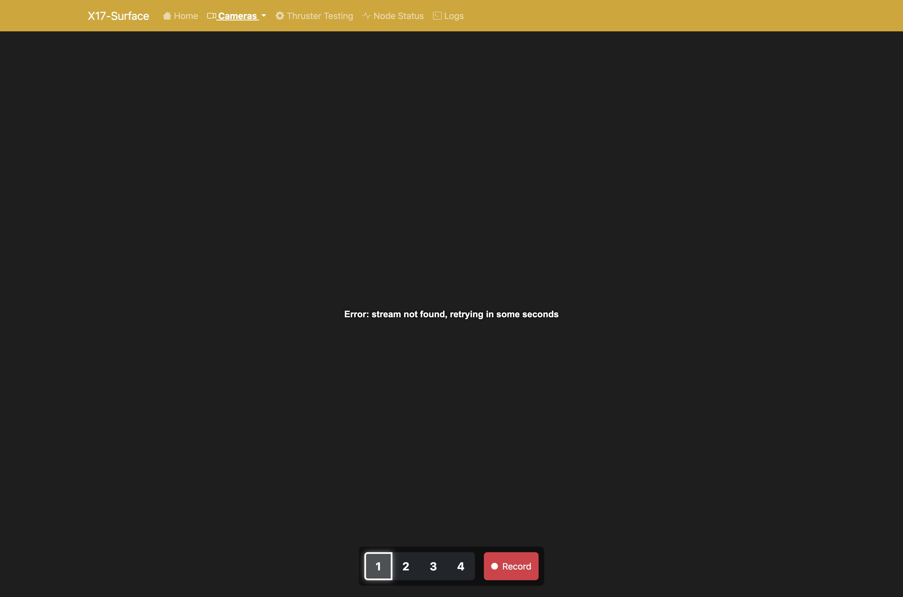

README for the frontend directory
# Frontend

This directory contains the frontend code for our ROV. It is written using basic HTML, CSS, and JavaScript aided by Bootstrap, and served using Flask. 

## Components

#### Dashboard
The dashboard is the main page of the frontend. It displays the current status of the ROV—including depth and other telemetry data—and provides video feeds from the ROV cameras.

#### Cameras
This section contains several sub-pages.

- **Fullscreen Camera**: Displays a fullscreen video feed from the ROV cameras. Users can switch between different camera feeds either by clicking the buttons provided or by using keyboard shortcuts (1, 2, 3, 4). Recording can be started and stopped; recordings are stored on the server in the `/videos` directory.

- **All Cameras**: Displays a grid of all four camera feeds. Clicking a feed enlarges it to fullscreen mode.

- **Recordings**: Lists all recordings made by the ROV. Users can play back or download a selected recording.

#### Thruster Testing
This section allows users to test the ROV’s thrusters. Users can select one or more thrusters and send messages to the `/rov/final_thruster` topic.

#### Logs
This page displays logs from the frontend processes. Logs can be filtered by severity level (INFO, WARNING, ERROR) or by node (process). Logs are stored in the `/logs` directory on the server, keeping only the 10 most recent files.

## Dependencies

### [Flask](https://flask.palletsprojects.com/)
We use Flask as our backend server because it is Python-based, which simplifies integration with our ROS2 Python codebase.

### [Bootstrap](https://getbootstrap.com/)
Bootstrap is included to create a responsive and visually appealing frontend with pre-designed components and customizable styles.

### [Socket.IO](https://socket.io/)
Socket.IO establishes a WebSocket connection between the frontend and backend, enabling real-time updates of telemetry data and video feeds from the ROV by relaying ROS2 messages.

## FAQ

### How do messages get from the core to the frontend?
The surface computer runs a ROS2 node called `ui_subscriber`, located in `ros/rov_ui/ui_subscriber.py`. This node subscribes to various topics and converts ROS2 messages into JSON format. The messages are then emitted to the frontend via Flask-SocketIO and rebroadcast by `app.py` to the webpage.

### What are all the curly brace blocks in the HTML templates?
These curly brace blocks belong to [Jinja2](https://jinja.palletsprojects.com/en/stable/templates/)—the engine that Flask uses for templating. They denote variables and control structures (such as if statements and loops), which allow the HTML pages to dynamically adapt their content based on data received from the backend.
